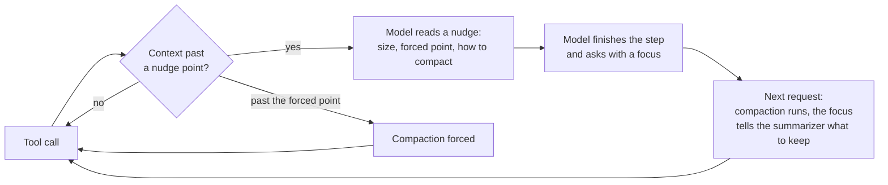

<div align="center">

# sub-agent-compact

**Smart auto-compact for Claude Code: a separate compaction point for every sub-agent, and self-compaction at a milestone the model chooses.**

[](https://docs.claude.com/en/docs/claude-code/plugins)
[](./CHANGELOG.md)
[](./LICENSE)
[](#development)
[](https://github.com/rezzminator/professor)

**34% cheaper** than a sub-agent that never compacts · **52% less context** re-sent on every request

</div>

```yaml
---
name: big-reader
description: Reads large files in full.
autoCompact:
  forceAt: 60%      # compacts here even if the model never asked
  nudgeFrom: 20%    # first nudge to reach a milestone and compact itself
  nudgeEvery: 10%   # one more nudge at each step past the first
  enabled: true     # false: never nudged or compacted automatically
---
```

<sup>Add `autoCompact` to any agent's frontmatter in `.claude/agents/*.md`. Every key is optional; a key left out takes the central default. See <a href="#per-agent-policy-frontmatter">Per-agent policy</a>.</sup>

---

Claude Code compacts the main chat and every sub-agent at one shared
auto-compact threshold. Long-running sub-agents therefore either re-send a
huge context on every tool call, or get compacted blindly in the middle of
their work.

**sub-agent-compact** gives each party its own compaction policy, and lets
the model decide *when* to compact.

- 🎯 **Per-agent auto-compact thresholds.** The main chat, each sub-agent
  type and each built-in (`general-purpose`, `Explore`) gets its own point,
  set in `settings.json` or in the agent's frontmatter.
- 🧠 **Self-compaction at milestones.** As the context grows, the model is
  nudged to finish the step in hand and compact itself. It picks the moment
  and names what the summary must keep.
- 🛟 **A forced point as the safety net.** A party whose model ignores the
  nudges is still compacted when it reaches its ceiling.
- 🪶 **Haiku is left alone.** Small, fast agents compact only at Claude
  Code's own point.
- 📜 **Every decision logged** to a JSONL file per session, when you want to
  see why a compaction ran or was held.

## 📊 Benchmark

The job: one Sonnet 5 sub-agent renames an identifier across **24 Go files**,
Edit only, about **500 model requests**, with the same brief in every run.

| | No compaction | **sub-agent-compact** |
|---|---:|---:|
| **Cost** | $18.39 | **$12.20** |
| Cost per request | $0.036 | $0.024 |
| Mean context per request | 161k | 77k |
| Executor time | 29 min | 47 min |
| Compactions | 0 | 4, each at a milestone the model chose |
| Files exactly right | 24/24 | 23/24 |

**Where the saving comes from.** Every tool call re-sends the whole
context, so a sub-agent that never compacts pays for its whole history again
on each request. Self-compaction halved the mean context. That cut cache
reads from $16.32 to $7.59, a saving of $8.73, of which compaction gave back
$2.56 in re-caching, extra output and summaries.

The run also exposed a bug, since fixed: a stale reading right after one
compaction used up a nudge, and that stretch ran to 205k before the next one.
The fixed version hasn't been re-measured, so no figure is claimed for it.

## 🚀 Quick start

```sh
# 1. Turn on function hooks, and let Claude Code ask to compact from about 65k
export CLAUDE_CODE_ENABLE_FUNCTION_HOOKS=1
export CLAUDE_CODE_AUTO_COMPACT_WINDOW=100000

# 2. Install
claude plugin marketplace add rezzminator/sub-agent-compact
claude plugin install sub-agent-compact@sub-agent-compact
```

Both variables also work in the `env` block of `settings.json`. That's all
you need: with the defaults, the main chat is nudged from 20% of its window
and sub-agents from 20%, every 10% after that, and each is forced at 60%.

> **Early access.** This plugin is built on Claude Code's function hooks,
> an early-access surface that may change between releases. It is tested on
> Claude Code 2.1.282 and 2.1.283.

## 🧠 How it works



1. **Nudges.** After a tool call, once a party's context passes its first
   nudge point, the model reads one line after the tool's result: how full
   it is, where it will be forced, and how to compact itself. Another line
   follows at each step past the first. The nudges start over after every
   compaction.
2. **Asking.** The main chat calls the `compact` tool
   (`mcp__sub-agent-compact__compact`) with a `focus`: the plan or its
   file, what is done, what is left, the next step. A sub-agent whose
   definition has a `tools:` allowlist can't see a plugin's tool, so it
   writes `<compact-now>its focus</compact-now>` in a response that also
   calls a tool.
3. **Running.** The request arms the party. The next time Claude Code asks
   to compact it, the plugin lets it through, and the focus becomes the
   summarizer's instructions. A party that never asks is held until its
   forced point, then compacted there.

Guards keep this honest:
- A marker quoted in backticks, one in a final answer, or one in the main
  chat's text arms nothing.
- A sub-agent that sends the marker alone would end its own run, because a
  response without a tool call is its final answer. The plugin refuses that
  stop once, and the agent carries on and compacts.
- A self-compaction is refused below the party's first nudge point
  (`mainAutoCompactNudgeStart`, `subagentAutoCompactNudgeStart`): there it
  throws away more working context than it saves. The model is told so and
  carries on.
- You can always call a self-compaction off. A message you send cancels a
  compaction the main chat armed, and the model is told not to ask again
  until your ask is done. An interrupt (Esc or Ctrl+C) during an armed
  compaction, or a compaction that is skipped or fails, also drops the
  request, so it never fires on the next request instead. A notification
  or a message from another chat cancels nothing.
- The main chat's nudges tell its model that a person waiting on an answer
  comes first: it never compacts while you wait.
- A Workflow run's agents get the sub-agent policy like any other: their
  type comes from Claude Code's `SubagentStart` hook, since
  `$.agent.list()` never names them.
- An engine loop that is not one of the session's sub-agents (a fork
  Claude Code runs itself) is left to Claude Code's own point: never nudged,
  armed or held.
- **A sub-agent keeps its brief.** Claude Code replaces a sub-agent's first
  message, the prompt its parent passed, with the summary, so exact paths,
  acceptance rows and standing rules would survive only as the summarizer's
  paraphrase. After each of its compactions the plugin seats that prompt
  again, verbatim, as the message right after the summary
  (`subagentKeepBrief`, on by default; the main chat is untouched). The
  seated message opens with one marker line, so a later compaction finds
  it: the sub-agent holds exactly one copy however often it compacts.
  Past 64k tokens (characters / 4, the bound Codex keeps user messages to)
  the head up to that size is kept, followed by one line saying where the
  brief was cut. A skipped compaction is left as it is; an error in seating
  is logged and the compaction stands as Claude Code made it.
- A lookup that fails is logged, and the compaction goes through. The
  plugin never holds a compaction because of its own error.

## ⚙️ Configuration

### Central options

Set these through `/config`, or under
`pluginConfigs["sub-agent-compact@sub-agent-compact"].options` in
`settings.json`. The key must be the full plugin id: Claude Code silently
ignores options under any other key.

A **size** is a percentage of the model's own window (`"10%"`), an integer,
or a number with a k/m suffix (`"150k"`, `"0.6m"`). A bad value is logged by
name and replaced by the default, never ignored silently.

| Option | Default | Meaning |
| --- | --- | --- |
| `mainAutoCompact` | `60%` | The main chat's forced point. |
| `mainAutoCompactNudgeStart` | `20%` | The main chat's first nudge. |
| `mainAutoCompactNudgeEvery` | `10%` | The step between the main chat's nudges. |
| `mainAutoCompactEnabled` | `true` | Off: the main chat is never nudged or compacted automatically; its own request still runs. |
| `subagentAutoCompact` | `60%` | A sub-agent's forced point, unless its definition sets its own. It covers built-ins such as `general-purpose` and `Explore`. |
| `subagentAutoCompactNudgeStart` | `20%` | A sub-agent's first nudge. |
| `subagentAutoCompactNudgeEvery` | `10%` | The step between a sub-agent's nudges. |
| `subagentAutoCompactEnabled` | `true` | Off: sub-agents are never nudged or compacted automatically; their own requests still run. |
| `subagentKeepBrief` | `true` | On: after each compaction a sub-agent's brief is seated again verbatim right after the summary. Off: the summary alone stands for it. |
| `agentDirs` | empty | Comma-separated extra directories of agent definitions. |
| `logFile` | empty | Absolute path of the JSONL decision log. Each session writes its own file: `decisions.jsonl` becomes `decisions.{session-id}.jsonl`. |

```json
{
  "env": { "CLAUDE_CODE_ENABLE_FUNCTION_HOOKS": "1", "CLAUDE_CODE_AUTO_COMPACT_WINDOW": "100000" },
  "pluginConfigs": {
    "sub-agent-compact@sub-agent-compact": {
      "options": { "mainAutoCompact": "600k", "subagentAutoCompact": "60%", "subagentAutoCompactNudgeStart": "20%" }
    }
  }
}
```

### Per-agent policy (frontmatter)

Give one agent its own policy under `autoCompact` in its definition. Every
key is optional, and a key left out takes the central `subagent*` value:

```markdown
---
name: big-reader
description: Reads large files in full.
autoCompact:
  forceAt: 60%      # compacts here even if the model never asked
  nudgeFrom: 20%    # first nudge to reach a milestone and compact itself
  nudgeEvery: 10%   # one more nudge at each step past the first
  enabled: true     # false: never nudged or compacted automatically
---
You read files...
```

- A bare `autoCompact: 200k` is shorthand for `autoCompact.forceAt`.
- `enabled: false` suits an agent whose context must stay verbatim. Past
  its window it fails the way Claude Code does with auto-compact off.
- **Where the plugin looks** for a sub-agent's definition, by its type:
  `<cwd>/.claude/agents/<type>.md`, then `~/.claude/agents/<type>.md`, then
  each `agentDirs` entry. After those, it takes any file whose frontmatter
  `name:` matches.

### Model windows

Percentages are of each model's own window. The main chat's comes from
Claude Code. A sub-agent's comes from its model id: Haiku 200k, Sonnet 5 and
any `[1m]` model 1M, a model that is not Claude (a GPT model behind a
gateway) Claude Code's 200k default, and any other Claude model the main
chat's window.

### The window rule

A plugin can hold a compaction back, but it can't make Claude Code ask
sooner. Claude Code asks to compact a party only once it nears
`CLAUDE_CODE_AUTO_COMPACT_WINDOW`: about 33k below that value, measured as
about 65k for `100000`. So **set the window so Claude Code asks at or below
your smallest nudge point.** `100000` suits the defaults. A request a model
makes below that point waits until the party reaches it.

Letting a plugin start a compaction for any sub-agent from code would remove
this rule. It is requested upstream in
[anthropics/claude-code#91870](https://github.com/anthropics/claude-code/issues/91870#issuecomment-5848066352).

## ❓ FAQ

<details>
<summary><b>How do I set a different auto-compact threshold for sub-agents in Claude Code?</b></summary>

Install this plugin and set `subagentAutoCompact` (for all sub-agents) or
`autoCompact.forceAt` in one agent's frontmatter. Claude Code's own
`CLAUDE_CODE_AUTO_COMPACT_WINDOW` and `autoCompactWindow` apply to the whole
process, the main chat and every sub-agent alike
([#90347](https://github.com/anthropics/claude-code/issues/90347)).
</details>

<details>
<summary><b>Why do my sub-agents cost so much?</b></summary>

Every tool call re-sends the whole context. A sub-agent that runs for a few
hundred tool calls without compacting pays for its entire history on each
one. In the benchmark above, that is the difference between $18.39 and
$12.20.
</details>

<details>
<summary><b>Can Claude compact itself when it decides to?</b></summary>

Yes, that's the self-compaction feature. The main chat calls the `compact`
tool. A sub-agent writes `<compact-now>focus</compact-now>` alongside its
next tool call. In both cases the focus tells the summarizer what to keep. It
only arms once the context has passed the first nudge point.
</details>

<details>
<summary><b>Can I keep the main chat large and the sub-agents small, or the other way round?</b></summary>

Yes. The main chat's and the sub-agents' policies are independent, and each
agent type can override the sub-agent policy in its frontmatter.
</details>

<details>
<summary><b>Why doesn't the PreCompact hook work for this?</b></summary>

The classic `PreCompact` hook fires for a sub-agent's compaction without the
agent's id, so it can't tell which party is compacting
([#91910](https://github.com/anthropics/claude-code/issues/91910)). Function
hooks carry `agentId` on `session.compact`, which is what this plugin
decides on.
</details>

<details>
<summary><b>Does it work in headless mode (<code>claude -p</code>) and the Agent SDK?</b></summary>

Sub-agent compaction and self-compaction do. Compacting the main chat
between turns needs an interactive session: in `-p`, Claude Code 2.1.283
rejects it, and the plugin logs that and carries on.
</details>

<details>
<summary><b>What is the "not compacted · main 311k/600k" notice?</b></summary>

It appears each time the plugin holds a compaction Claude Code asked for: the
party, its context now, and where it will be compacted. Claude Code draws
every held compaction as a notice, and plugins have no way to hold one
silently yet, so the plugin keeps the line as short as it can.
</details>

## 🛠️ Development

```sh
npm install
npm test              # unit tests for plugins/sub-agent-compact/src/
npm run typecheck
npm run validate:plugin
```

Work lands on `develop`; `main` holds only releases, and each one is tagged `sub-agent-compact--vX.Y.Z` with its notes in [CHANGELOG.md](./CHANGELOG.md). Pull requests go to `develop`.

`plugins/sub-agent-compact/hooks/sub-agent-compact.ts` is a thin adapter over `plugins/sub-agent-compact/src/`:

| Module | Role |
| --- | --- |
| `limits.ts` | Sizes and options, parsed into a policy per party |
| `frontmatter.ts` | Agent frontmatter, one level of nesting |
| `agents.ts` | Resolves an agent type to its policy |
| `window.ts` | Model windows and Claude Code's ask point |
| `nudge.ts` | Nudge levels and text, the `<compact-now>` marker, the compact tool's reply |
| `brief.ts` | Seats a sub-agent's brief back after the summary, once, up to 64k tokens |
| `parties.ts` | Per-party state: readings, the armed focus, nudges sent, a refused stop |
| `decide.ts` | The decision for one compaction request |

## 🎓 Built with Professor

sub-agent-compact is built and maintained with [Professor](https://github.com/rezzminator/professor), a fleet controller and discipline layer for Claude Code, Codex and OpenCode: chats that message each other, agents held to the project's rules, and gated releases. This plugin came out of it: Professor runs long orchestrations of sub-agents, and their context bills are why per-agent compaction exists.

## License

MIT

<sub>Keywords: Claude Code sub-agent compact · subagent auto-compact · smart compact · per-agent auto-compact threshold · autoCompactWindow per agent · CLAUDE_CODE_AUTO_COMPACT_WINDOW · context window management · context compaction · self-compaction · Claude Code plugin · function hooks · Claude Mods · multi-agent orchestration token cost</sub>
